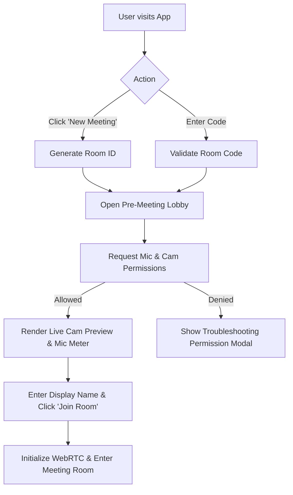
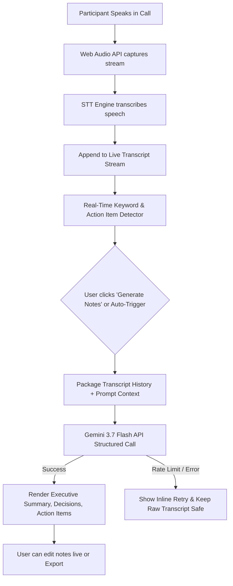

# UX Architecture & User Flows — SyncMeet AI

---

## 1. Information Architecture (IA)

```
[ SyncMeet AI Web App ]
│
├── 1.0 Landing / Instant Lobby
│   ├── Create Instant Meeting (Generates Room ID)
│   ├── Join Existing Meeting (Code Input)
│   ├── Device Preview Modal (Camera test, Mic volume visualizer, Name input)
│   └── Audio/Video Permission Prompt & Diagnostic Helper
│
├── 2.0 In-Meeting Workspace (/room/:roomId)
│   ├── 2.1 Header Bar
│   │   ├── Room Title & Live Duration Timer
│   │   ├── Active Transcription Status Badge ("● Recording / Transcribing")
│   │   ├── Participant Count & Invite Link Popover
│   │   └── Settings & AI Model Switcher
│   │
│   ├── 2.2 Adaptive Media Stage (Left ~70%)
│   │   ├── Dynamic Video Tile Grid (1, 2, 3, 4+ Layouts)
│   │   ├── Active Speaker Glowing Border Indicator
│   │   ├── Screen Share Spotlight Mode (Primary screen + thumbnail strip)
│   │   └── Local Video Floating PiP / Tile
│   │
│   ├── 2.3 Floating Control Dock (Bottom Center)
│   │   ├── Mic Mute/Unmute (with Audio Level Pulse)
│   │   ├── Camera On/Off
│   │   ├── Screen Share Toggle
│   │   ├── Live Captions Overlay Toggle (CC)
│   │   ├── Sidebar Panel Toggle (Transcript / AI Notes / Chat)
│   │   └── Leave / End Meeting (Red Button with Confirmation)
│   │
│   └── 2.4 Real-Time Intelligence Sidebar (Right ~30%)
│       ├── Tab 1: Live Transcript (Auto-scrolling speech bubbles, timestamps, speaker tags)
│       ├── Tab 2: AI Meeting Notes (Structured Markdown: Summary, Decisions, Action Items)
│       │   ├── "Generate / Refresh AI Notes" Action Button
│       │   ├── Interactive Action Item Checkboxes
│       │   └── Export Actions (Copy Markdown, Download .md, JSON)
│       └── Tab 3: Room Chat & Shared Links
│
└── 3.0 Post-Meeting Summary View (Modal or Standalone Screen)
    ├── Meeting Recap & Total Duration
    ├── Full Generated Summary & Action Item Matrix
    ├── Full Transcript Download
    └── "Start Another Meeting" CTA
```

---

## 2. Detailed User Journey Flows

### Flow 1: Host Room Creation & Device Setup


### Flow 2: Live In-Meeting Transcription & AI Notes Generation


---

## 3. Wireframes & Spatial Layouts

### 3.1 Pre-Meeting Lobby Wireframe
```
+-------------------------------------------------------------+
|  SyncMeet AI                                    [Help] [⚙]  |
+-------------------------------------------------------------+
|                                                             |
|                 Ready to join your meeting?                 |
|                                                             |
|         +-------------------------+                         |
|         |                         |   Your Name:            |
|         |      [LIVE CAMERA]      |   [ Sarah Jenkins     ] |
|         |                         |                         |
|         |   Mic: [||||||....]     |   Camera: [ Facetime HD]|
|         +-------------------------+   Mic:    [ Built-in Mic]|
|              [ 🎤 ]    [ 📹 ]                               |
|                                       [  JOIN MEETING NOW ] |
|                                                             |
+-------------------------------------------------------------+
```

### 3.2 In-Meeting Main Workspace Wireframe
```
+-------------------------------------------------------------------------------+
| SyncMeet AI  •  Sprint Sync (00:14:22)  [● Live AI Notes]       [👥 3] [🔗 Share]|
+------------------------------------------------------+------------------------+
|                                                      |  [Transcript] [AI NOTES]|
|  +------------------------+-----------------------+  | +--------------------+ |
|  |                        |                       |  | ⚡ AI Live Summary     | |
|  |      Sarah (Host)      |      Alex (Eng)       |  |                      | |
|  |     [🎤 Active]        |                       |  | **Executive Summary**: | |
|  |                        |                       |  | The team reviewed the | |
|  +------------------------+-----------------------+  | auth migration plan.  | |
|  |                        |                       |  |                      | |
|  |      Elena (Design)    |     [Local User]      |  | **Decisions**:       | |
|  |                        |                       |  | • Use OAuth2 PKCE     | |
|  |                        |                       |  |                      | |
|  +------------------------+-----------------------+  | **Action Items**:    | |
|                                                      | [ ] Alex: Draft specs | |
|                                                      | [ ] Sarah: Update PRD | |
|                                                      |                      | |
|            [ 🎤 ]  [ 📹 ]  [ 🖥️ Share ]  [ 📝 Notes ]  | [ 🔄 Update Notes ]  | |
|                     [ 🔴 End Call ]                  | [ 📋 Copy ] [ 💾 Export| |
+------------------------------------------------------+------------------------+
```

---

## 4. State Matrix: Happy, Failure & Recovery Paths

| State Scenario | System Behavior | UI Feedback | Recovery Action |
| :--- | :--- | :--- | :--- |
| **Happy Path: Clean Audio & Connected** | Stream plays, live transcript scrolls, AI notes update. | Green audio pulses, subtle timestamp bubbles. | Normal operation. |
| **Permission Denied (Cam/Mic)** | Audio/video tracks disabled, fallback to text-only mode. | Clear amber warning banner with step-by-step browser unblock guide. | User clicks "Re-check Permissions" button. |
| **Network Jitter / Packet Loss** | WebRTC attempts bounded ICE recovery after a connection fails. | Recovery warnings are logged; the video tile remains visible while reconnecting. | Retry the connection; configure TURN for restrictive networks. |
| **AI Generation Rate Limit / Timeout** | In-flight generation spinner stops; raw transcript preserved intact. | Red toast: "AI summary generation timed out. Raw notes preserved." | "Retry AI Generation" button with exponential backoff. |
| **Screen Share Abruptly Stopped** | Layout dynamically shifts back from Spotlight grid to balanced 2x2 grid. | Smooth transition animation; screen share button resets state. | User can re-share screen at any time. |

---

## 5. Accessibility & Responsive UX Requirements
* **Keyboard Shortcuts**:
  * `Spacebar` (Hold): Push-to-talk unmute
  * `Ctrl / Cmd + D`: Toggle Microphone
  * `Ctrl / Cmd + E`: Toggle Camera
  * `Ctrl / Cmd + Shift + S`: Trigger AI Notes Update
* **Contrast & Legibility**: WCAG AAA compliant text contrast over dark video backgrounds.
* **Mobile / Small Screen Responsiveness**: Stack the video stage above the collapsible transcript/notes panel; keep the meeting controls horizontally scrollable on narrow screens.