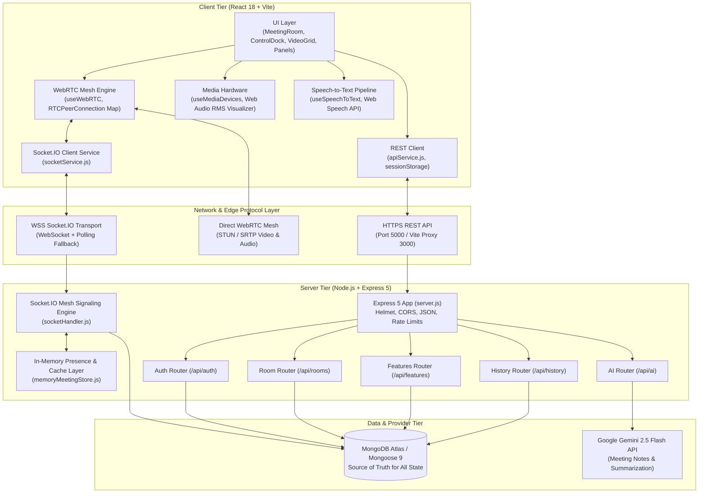
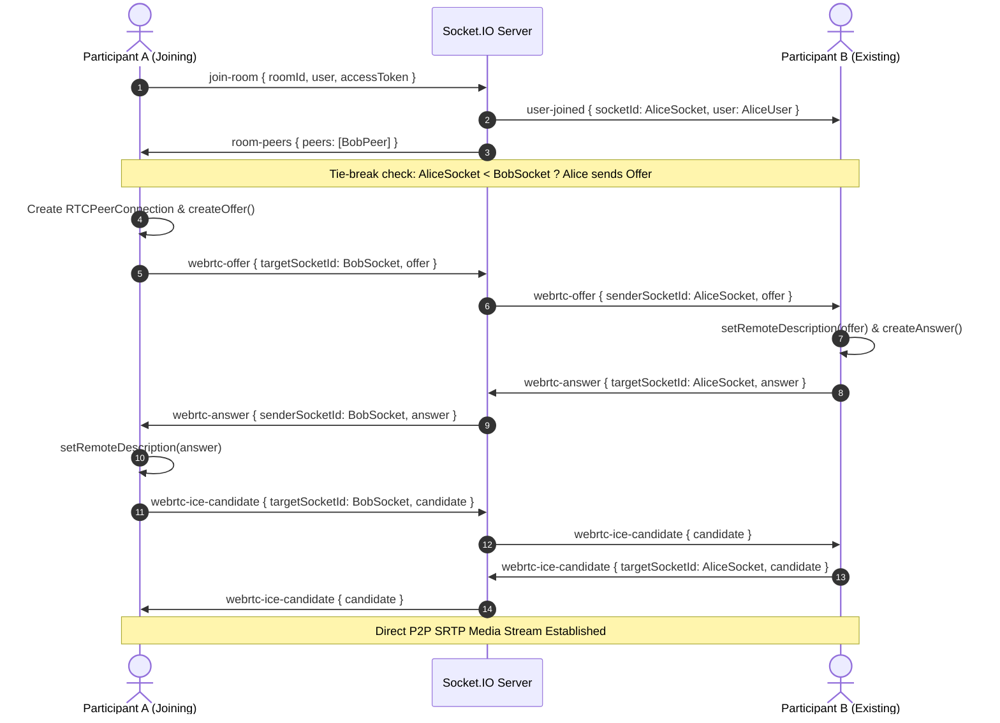

# SyncMeet AI System Architecture & State Ownership Specification

## 1. System Overview & Architecture Diagram

SyncMeet AI is a production real-time video conferencing application designed for high-concurrency meetings, integrated AI transcription and summarization, interactive collaboration (chat, whiteboard, polls, Q&A, agendas, reactions), and host-moderated breakout and waiting rooms.

### Architecture Component Diagram

---

## 2. Full REST API Specification

| Endpoint                                                   | Method   | Auth / Access Middleware                             | Zod / Schema Validation                                                 | Controller / Service Logic                                                                                                                                    | DB Models Touched                                          |
| :--------------------------------------------------------- | :------- | :--------------------------------------------------- | :---------------------------------------------------------------------- | :------------------------------------------------------------------------------------------------------------------------------------------------------------ | :--------------------------------------------------------- |
| `/api/auth/register`                                       | `POST`   | Public, `authenticationLimiter`                      | `registrationSchema` (name, email, password min 8)                      | Hashes password with bcrypt (10 rounds), creates User doc, creates AuthSession, sets HttpOnly refresh cookie, returns access JWT                              | `User`, `AuthSession`                                      |
| `/api/auth/login`                                          | `POST`   | Public, `authenticationLimiter`                      | `loginSchema` (email, password)                                         | Constant-time password verify, creates AuthSession, sets HttpOnly refresh cookie, returns access JWT + user                                                   | `User`, `AuthSession`                                      |
| `/api/auth/refresh`                                        | `POST`   | Public, cookie origin checked                        | Cookie `syncmeet_refresh` format check                                  | Revokes old session, creates new AuthSession (refresh token rotation), returns new access JWT                                                                 | `AuthSession`, `User`                                      |
| `/api/auth/logout`                                         | `POST`   | Public                                               | None                                                                    | Revokes AuthSession by hashed refresh token, clears refresh cookie                                                                                            | `AuthSession`                                              |
| `/api/auth/me`                                             | `GET`    | `protect` (Bearer JWT)                               | None                                                                    | Validates active session in DB, returns sanitized profile                                                                                                     | `User`, `AuthSession`                                      |
| `/api/auth/profile`                                        | `PUT`    | `protect` (Bearer JWT)                               | Schema: name (1-80), title, avatar, avatarColor                         | Updates user profile fields in DB, returns updated sanitized profile                                                                                          | `User`                                                     |
| `/api/rooms/create`                                        | `POST`   | `protect` (Bearer JWT)                               | Room ID string check, title (max 150), settings schema                  | Creates new active room doc with caller as `hostId`, issues signed room access token with role `host`                                                         | `Room`                                                     |
| `/api/rooms/guest`                                         | `POST`   | `optionalProtect`                                    | Title (max 150), hostName (max 120)                                     | Creates room doc with generated `guest-xxx` or user id, issues signed room access token                                                                       | `Room`                                                     |
| `/api/rooms/:roomId/join`                                  | `POST`   | `optionalProtect`                                    | `roomId` (max 120), `name` (max 120)                                    | Validates room exists and isActive, creates or reuses participant identity, issues signed room access token                                                   | `Room`, `ScheduledMeeting`                                 |
| `/api/rooms/:roomId`                                       | `GET`    | `requireRoomAccess`                                  | `roomId` param check                                                    | Returns sanitized room metadata (title, hostName, isLocked, settings, agenda, isActive)                                                                       | `Room`                                                     |
| `/api/rooms/:roomId/state`                                 | `GET`    | `requireRoomAccess`                                  | `roomId` param check                                                    | **Required REST Rejoin Endpoint**: Returns full room rehydration state (metadata, active participants with media state, lock status, active breakout session) | `Room`, `BreakoutSession`                                  |
| `/api/features/templates`                                  | `GET`    | Public                                               | None                                                                    | Returns standard conference templates (standup, planning, retrospective, etc.)                                                                                | None                                                       |
| `/api/features/schedules`                                  | `GET`    | Public                                               | None                                                                    | Lists public upcoming scheduled meetings                                                                                                                      | `ScheduledMeeting`                                         |
| `/api/features/schedules/:roomId`                          | `GET`    | Conditional `requireRoomAccess` if private           | `roomId` param check                                                    | Returns scheduled meeting details; requires access token if invitees list is present                                                                          | `ScheduledMeeting`                                         |
| `/api/features/schedules`                                  | `POST`   | `optionalProtect`                                    | `schedulePayload` validation (startsAt, duration, timezone, agenda)     | Creates ScheduledMeeting and companion Room document                                                                                                          | `ScheduledMeeting`, `Room`                                 |
| `/api/features/schedules/:roomId`                          | `DELETE` | `requireRoomAccess`, `requireRoomHost`               | `roomId` param check                                                    | Cancels scheduled meeting and deactivates Room                                                                                                                | `ScheduledMeeting`, `Room`                                 |
| `/api/features/rooms/:roomId/notes`                        | `GET`    | `requireRoomAccess`                                  | `roomId` param check                                                    | Fetches current saved AI notes, action items, decisions, and open questions                                                                                   | `AINote`                                                   |
| `/api/features/rooms/:roomId/notes`                        | `PUT`    | `requireRoomAccess`                                  | Summary (max 30k), decisions, actionItems, openQuestions                | Upserts meeting AI notes document in DB                                                                                                                       | `AINote`                                                   |
| `/api/features/rooms/:roomId/agenda`                       | `GET`    | `requireRoomAccess`                                  | `roomId` param check                                                    | Fetches current room agenda items                                                                                                                             | `MeetingAgenda`, `Room`, `ScheduledMeeting`                |
| `/api/features/rooms/:roomId/agenda`                       | `PUT`    | `requireRoomAccess`                                  | Agenda items array (max 20 items, max 300 chars)                        | Upserts meeting agenda items in DB                                                                                                                            | `MeetingAgenda`                                            |
| `/api/features/rooms/:roomId/polls`                        | `GET`    | `requireRoomAccess`                                  | `roomId` param check                                                    | Fetches all polls for the meeting room                                                                                                                        | `MeetingPoll`                                              |
| `/api/features/rooms/:roomId/polls`                        | `POST`   | `requireRoomAccess`                                  | Question (max 300), options (2-8 options, max 120 chars), allowMultiple | Creates a new meeting poll                                                                                                                                    | `MeetingPoll`                                              |
| `/api/features/rooms/:roomId/polls/:pollId/votes`          | `POST`   | `requireRoomAccess`                                  | `optionIds` array check                                                 | Records participant vote atomically (idempotent, single or multi)                                                                                             | `MeetingPoll`                                              |
| `/api/features/rooms/:roomId/polls/:pollId/close`          | `PATCH`  | `requireRoomAccess`, `requireRoomHost`               | `pollId` check                                                          | Closes poll to further voting                                                                                                                                 | `MeetingPoll`                                              |
| `/api/features/rooms/:roomId/questions`                    | `GET`    | `requireRoomAccess`                                  | `roomId` check                                                          | Fetches all Q&A questions for room                                                                                                                            | `MeetingQuestion`                                          |
| `/api/features/rooms/:roomId/questions`                    | `POST`   | `requireRoomAccess`                                  | Text (max 1000 chars)                                                   | Submits attendee question to Q&A board                                                                                                                        | `MeetingQuestion`                                          |
| `/api/features/rooms/:roomId/questions/:questionId/upvote` | `POST`   | `requireRoomAccess`                                  | `questionId` check                                                      | Toggles upvote on question for participant                                                                                                                    | `MeetingQuestion`                                          |
| `/api/features/rooms/:roomId/questions/:questionId/answer` | `PATCH`  | `requireRoomAccess`, `requireRoomHost`               | `questionId` check                                                      | Toggles answered state on question                                                                                                                            | `MeetingQuestion`                                          |
| `/api/features/rooms/:roomId/breakouts`                    | `GET`    | `requireRoomAccess`                                  | `roomId` check                                                          | Fetches active breakout session and groups                                                                                                                    | `BreakoutSession`                                          |
| `/api/features/rooms/:roomId/breakouts`                    | `POST`   | `requireRoomAccess`, `requireRoomHost`               | Groups (2-20), participant assignments, endsAt                          | Creates active breakout session                                                                                                                               | `BreakoutSession`                                          |
| `/api/features/rooms/:roomId/breakouts/:breakoutId/end`    | `PATCH`  | `requireRoomAccess`, `requireRoomHost`               | `breakoutId` check                                                      | Ends breakout session and marks ended                                                                                                                         | `BreakoutSession`                                          |
| `/api/history/recent`                                      | `GET`    | `protect`                                            | None                                                                    | Returns user's attended/hosted meeting history excluding hidden rooms                                                                                         | `MeetingAttendance`, `Room`, `HiddenMeeting`, `Transcript` |
| `/api/history/save`                                        | `POST`   | `requireRoomAccess`, `requireRoomArchiveWriteAccess` | `validateArchive` (transcripts max 2000, AI notes)                      | Stores complete meeting transcripts and archives room                                                                                                         | `Transcript`, `AINote`, `Room`                             |
| `/api/history/rooms/:roomId`                               | `GET`    | `requireRoomHistoryAccess`                           | `roomId` check                                                          | Fetches meeting archive (transcripts, summary, attendance)                                                                                                    | `Room`, `Transcript`, `AINote`, `MeetingAttendance`        |
| `/api/history/rooms/:roomId/hide`                          | `POST`   | `protect`                                            | `roomId` check                                                          | Adds room to user's HiddenMeeting list                                                                                                                        | `HiddenMeeting`                                            |
| `/api/ai/rooms/:roomId/summarize`                          | `POST`   | `requireRoomAccess`                                  | `validateTranscripts` (1-500 entries, max 120k chars)                   | Calls Gemini 2.5 Flash with strict JSON schema to generate summary, decisions, action items                                                                   | None (Gemini API)                                          |
| `/api/ai/rooms/:roomId/ask`                                | `POST`   | `requireRoomAccess`                                  | Transcripts validation, question max 2000 chars                         | Queries Gemini 2.5 Flash on meeting context                                                                                                                   | None (Gemini API)                                          |

---

## 3. Real-Time Socket.IO Events Specification

### Client to Server (Listening on Server)

| Socket Event               | Payload Schema                               | Authorization Check                                            | State & DB Updates                                                                                                                                                | Emitted Responses / Broadcasts                                                                                                |
| :------------------------- | :------------------------------------------- | :------------------------------------------------------------- | :---------------------------------------------------------------------------------------------------------------------------------------------------------------- | :---------------------------------------------------------------------------------------------------------------------------- |
| `knock-room`               | `{ roomId, user, accessToken }`              | `verifySocketRoomAccess` (token must belong to room, non-host) | Adds socket to `pendingKnocks.get(roomId)`                                                                                                                        | Server emits `knock-request` to room hosts                                                                                    |
| `admit-user`               | `{ applicantSocketId }`                      | Must be active host in room                                    | Updates `Room.admittedParticipantIds`, records admitted knock                                                                                                     | Emits `knock-response` (`approved: true`) to applicant                                                                        |
| `deny-user`                | `{ applicantSocketId, user }`                | Must be active host in room                                    | Removes from `pendingKnocks`                                                                                                                                      | Emits `knock-response` (`approved: false`) to applicant                                                                       |
| `join-room`                | `{ roomId, user, accessToken }`              | `verifySocketRoomAccess` (token matches room/parent room)      | Adds socket to room; persists participant in `Room.participants`; upserts `MeetingAttendance` (keyed by room+user); cancels pending grace period disconnect timer | Emits `room-peers`, `local-media-state`, `room-lock-status`, `room-chat-history` to joiner; broadcasts `user-joined` to peers |
| `update-media-state`       | `{ isMuted: boolean, isVideoOff: boolean }`  | Participant must be in room                                    | Updates participant media state in memory and writes through to `Room.participants`                                                                               | Broadcasts `participant-media-state` to room                                                                                  |
| `webrtc-offer`             | `{ targetSocketId, offer }`                  | Both sender & target must be active in room                    | None (Signaling passthrough)                                                                                                                                      | Emits `webrtc-offer` to `targetSocketId`                                                                                      |
| `webrtc-answer`            | `{ targetSocketId, answer }`                 | Both sender & target must be active in room                    | None (Signaling passthrough)                                                                                                                                      | Emits `webrtc-answer` to `targetSocketId`                                                                                     |
| `webrtc-ice-candidate`     | `{ targetSocketId, candidate }`              | Both sender & target must be active in room                    | None (Signaling passthrough)                                                                                                                                      | Emits `webrtc-ice-candidate` to `targetSocketId`                                                                              |
| `ice-restart-request`      | `{ targetSocketId }`                         | Both sender & target must be active in room                    | None (Signaling passthrough)                                                                                                                                      | Emits `ice-restart-request` to `targetSocketId`                                                                               |
| `send-chat-message`        | `{ text, id }`                               | Participant must be in room                                    | Appends to `roomChatHistory` (and persists to DB)                                                                                                                 | Broadcasts `receive-chat-message` to room                                                                                     |
| `send-reaction`            | `{ emoji, x, duration }`                     | Participant must be in room                                    | None (Ephemeral)                                                                                                                                                  | Broadcasts `receive-reaction` to room                                                                                         |
| `whiteboard-draw`          | `{ x0, y0, x1, y1, color, brushSize, mode }` | Participant must be in room                                    | None (Streamed canvas)                                                                                                                                            | Broadcasts `whiteboard-draw` to room                                                                                          |
| `whiteboard-clear`         | `{}`                                         | Participant must be in room                                    | None                                                                                                                                                              | Broadcasts `whiteboard-clear` to room                                                                                         |
| `caption-stream`           | `{ text, timestamp }`                        | Participant must be in room                                    | None                                                                                                                                                              | Broadcasts `caption-stream` to room                                                                                           |
| `meeting-poll-updated`     | `{ id }`                                     | Participant must be in room                                    | Validates against DB/store                                                                                                                                        | Emits `meeting-poll-updated` to all room sockets                                                                              |
| `meeting-question-updated` | `{ id }`                                     | Participant must be in room                                    | Validates against DB/store                                                                                                                                        | Emits `meeting-question-updated` to all room sockets                                                                          |
| `meeting-agenda-updated`   | `{}`                                         | Participant must be in room                                    | Reads canonical agenda                                                                                                                                            | Emits `meeting-agenda-updated` to all room sockets                                                                            |
| `start-breakout`           | `{ breakout: { id } }`                       | Host role required                                             | Moves sockets to breakout room IDs, updates BreakoutSession                                                                                                       | Emits `breakout-assignment` and `breakout-updated`                                                                            |
| `end-breakout`             | `{ breakoutId }`                             | Host role required                                             | Moves all sockets back to parent room, updates BreakoutSession                                                                                                    | Emits `breakout-assignment` and `breakout-updated`                                                                            |
| `return-from-breakout`     | `{}`                                         | Participant in breakout                                        | Returns caller socket to parent room                                                                                                                              | Emits `breakout-assignment` to caller, updates room sets                                                                      |
| `toggle-hand-raise`        | `{ isHandRaised: boolean }`                  | Participant must be in room                                    | Updates in-memory participant                                                                                                                                     | Broadcasts `user-hand-updated` to room                                                                                        |
| `host-mute-all`            | `{}`                                         | Host role required                                             | Sets `isMuted=true` for all non-hosts, persists in `Room.participants`                                                                                            | Broadcasts `host-mute-all-command` to room                                                                                    |
| `host-lock-room`           | `{ isLocked: boolean }`                      | Host role required                                             | Updates `Room.isLocked` in DB                                                                                                                                     | Broadcasts `room-lock-status` to room                                                                                         |
| `host-end-meeting`         | `{}`                                         | Host role required                                             | Updates `Room.isActive=false`, `endedAt`, marks `MeetingAttendance.leftAt`                                                                                        | Broadcasts `meeting-ended-by-host` to all participants                                                                        |
| `disconnect`               | None                                         | Implicit on socket close                                       | Starts 20s grace period timer. If not rejoined within window, removes participant from DB & memory, marks `MeetingAttendance.leftAt`, broadcasts `user-left`      | Delayed `user-left` broadcast if grace period expires                                                                         |

---

## 4. WebRTC Mesh Media & Signaling Architecture

SyncMeet AI employs a client-side mesh WebRTC topology for peer-to-peer audio and video streaming.

### 1. Connection Topology

- Each participant maintains an independent `RTCPeerConnection` to every other participant in the same active room (parent room or assigned breakout room).
- Peer connections are established symmetrically using STUN servers:
  - `stun:stun.l.google.com:19302`
  - `stun:stun1.l.google.com:19302`
  - `stun:stun2.l.google.com:19302`
- Tie-breaking rule for offer collision: When two participants discover each other, the socket whose `socketId` is lexicographically smaller (`localSocketId.localeCompare(remoteSocketId) < 0`) initiates the SDP Offer.

### 2. Media Stream Management

- `useMediaDevices`: Requests microphone and camera streams using `navigator.mediaDevices.getUserMedia` only after the app leaves the login view; it remains disabled while the login page is active. Provides screen-sharing streams using `navigator.mediaDevices.getDisplayMedia`.
- `outboundMediaStream`: Combines audio tracks from microphone with video tracks (from camera or screen capture).
- Track Replacement: Tracks are replaced on active transceivers via `RTCRtpSender.replaceTrack` without requiring full SDP renegotiation.
- Web Audio RMS Analysis: Analyzes microphone stream using `AudioContext` and `AnalyserNode` to compute live RMS volume levels (0–100) and speaking presence indicators.

### 3. Signaling Flow Diagram

---

## 5. Authentication, Token Lifecycle & Session Architecture

1. **User Identity & Persistence**:
   - Registered users: Stored in MongoDB `User` model with unique lowercased email and bcrypt password hash.
   - User sessions: Stored in `AuthSession` with unique sha256 `refreshTokenHash`, `sessionId`, and TTL index on `expiresAt` (default 7 days).
   - Guest users: Provided stable room-scoped identities tied to their meeting session and room access token.

2. **JWT Tokens**:
   - Access Token: Short-lived (15 minutes). Payload: `{ id, email, role, sessionId }`. Signed with `JWT_SECRET`.
   - Refresh Token: Long-lived (7 days), stored in an `HttpOnly`, `SameSite=Lax` (or `None` in prod), `Secure` cookie named `syncmeet_refresh`. Rotated on every `/api/auth/refresh` invocation.

3. **Room Access Tokens (Meeting Capability Tokens)**:
   - Signed JWT token containing: `{ roomId, participantId, role: 'host'|'participant', displayName, accountId }`.
   - Required for joining rooms, emitting socket events, requesting feature updates, and uploading meeting archives.
   - Scoped strictly to the specific `roomId`.

---

## 6. Comprehensive State Ownership Table

| Data Entity                | Canonical Source of Truth                      | Secondary Copies                                                                  | Stale Invalidation Point                                      | Resolution & Synchronization Rule                                                                                                                                                                                              |
| :------------------------- | :--------------------------------------------- | :-------------------------------------------------------------------------------- | :------------------------------------------------------------ | :----------------------------------------------------------------------------------------------------------------------------------------------------------------------------------------------------------------------------- |
| **`userId`**               | JWT / MongoDB `User` (`_id`)                   | Client `sessionStorage`, Socket `socket.user.id`                                  | Page reload, logout, token expiration                         | The user ID is extracted strictly from verified JWT tokens. Never generated randomly on reload for authenticated users.                                                                                                        |
| **`socketId`**             | Socket.IO Transport Layer (`socket.id`)        | Memory store `rooms` Map, WebRTC peer connection map                              | Tab reload, network reconnection, socket transport upgrade    | Ephemeral transport identifier only. All application identity (attendance, participants) is keyed by `userId`, not `socketId`.                                                                                                 |
| **`roomId`**               | MongoDB `Room` (`roomId`)                      | Client `sessionStorage`, URL path, memory store                                   | Room ended, participant left room                             | Canonical room ID is verified against MongoDB `Room.isActive`. Client clears `sessionStorage` on meeting exit.                                                                                                                 |
| **`participants`**         | MongoDB `Room.participants`                    | Memory store `rooms.get(roomId)`, React `remotePeers` state                       | Socket disconnect during refresh, multiple tabs, network drop | **DB is source of truth**. Server memory is a presence cache. On socket disconnect, participant enters 20s grace period. On page refresh, participant replaces socket ID without removal. Exactly one video tile per `userId`. |
| **`host` role**            | MongoDB `Room.hostId` + Room Token             | Memory store `room.hostId`, Client `session.isHost`                               | Host reloads page, host disconnects temporarily               | Host authority is verified against `Room.hostId` and signed room token. Host reloading the page maintains host role and does not end meeting.                                                                                  |
| **`mic/cam` state**        | Hardware Track State (`useMediaDevices`)       | MongoDB `Room.participants[i].isMuted/isVideoOff`, Memory store, Socket broadcast | Device hardware mute, background tab throttling, reload       | Client sends explicit `update-media-state`. Server updates memory cache and MongoDB `Room.participants`. Restored upon rejoin.                                                                                                 |
| **`chat` messages**        | MongoDB `Room.chatMessages` / In-Memory Buffer | Client React state `chatMessages`                                                 | Refresh, late joining participant                             | Server stores chat messages in buffer / DB. On `join-room`, server emits `room-chat-history` to rehydrate client.                                                                                                              |
| **`transcripts`**          | Client Speech Recognition / DB `Transcript`    | Client IndexedDB, React state `transcripts`, MongoDB `Transcript`                 | Refresh, meeting exit                                         | Client stores live transcripts in local IndexedDB. On meeting save or exit, transcripts are persisted in MongoDB `Transcript` collection.                                                                                      |
| **`polls` & votes**        | MongoDB `MeetingPoll` collection               | Memory store `roomPolls`, React `polls` state                                     | New poll created, vote cast in another tab/client             | DB stores canonical poll and voters array. Votes use atomic `$addToSet` / filtering. Socket event `meeting-poll-updated` triggers client sync.                                                                                 |
| **`questions` (Q&A)**      | MongoDB `MeetingQuestion` collection           | Memory store `roomQuestions`, React `questions` state                             | Question posted, upvoted, or marked answered                  | DB stores canonical questions and upvoter IDs. Socket event `meeting-question-updated` triggers client sync.                                                                                                                   |
| **`breakout` assignments** | MongoDB `BreakoutSession` collection           | Memory store `breakouts` Map, React `breakout` state                              | Host creates breakout, timer expires, participant reloads     | DB stores active session and group assignments. Breakout routing checks DB/memory to reconnect reloaded participants to their assigned room.                                                                                   |

---

## 7. Reload & Graceful Rejoin Mechanism

To resolve Symptom 1 (participant disappears on page reload):

1. **Grace Period on Disconnect**:
   - When a socket disconnects, the server does **NOT** immediately delete the participant from `rooms` or emit `user-left`.
   - Instead, the server marks the participant's status as `'reconnecting'` and schedules a **20-second grace period timer**.
   - If the user reconnects within 20 seconds (e.g., page refresh):
     - The timer is cancelled.
     - The participant's `socketId` is updated to the new socket connection.
     - WebRTC peer connections are cleanly re-established.
     - Other participants do **not** see a ghost tile or flickering departure/rejoin.
   - If the timer expires without a rejoin:
     - The participant is removed from `rooms` and `Room.participants`.
     - `MeetingAttendance.leftAt` is timestamped.
     - `user-left` is broadcast to remaining peers.

2. **Client Rehydration Flow**:
   - On page mount with saved session in `sessionStorage`:
     1. Client calls `GET /api/rooms/:roomId/state` to verify room is still active and retrieve authoritative room state.
     2. Reconnects `socketService` and emits `join-room` with the same `roomAccessToken` and `userId`.
     3. Initializes local media tracks and processes `room-peers` to establish WebRTC connections.
